# Проект автоматизации API тестирования для сайта [Allure.Autotests](https://allure.autotests.cloud/)
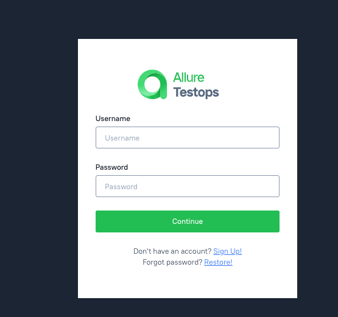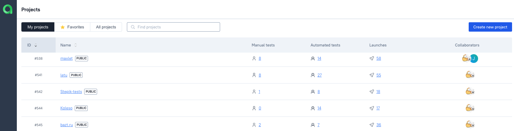

## **Содержание:**

____
* Технологии и инструменты
* Примеры автоматизированных тест-кейсов
* Сборка в Jenkins
* Запуск из терминала
* Allure отчет
* Интеграция с Allure TestOps
* Интеграция с JIRA
* Уведомления в Telegram при помощи бота
____

## <a name="Технологии и инструменты">**Технологии и инструменты:**</a>

<p align="center">  
<a href="https://rest-assured.io/"></a>
<a href="https://www.jetbrains.com/idea/"></a>  
<a href="https://www.java.com/"></a>  
<a href="https://github.com/"></a>  
<a href="https://junit.org/junit5/"></a>  
<a href="https://gradle.org/"></a>  
<a href="ht[images](images)tps://github.com/allure-framework/allure2"></a> 
<a href="https://qameta.io/"></a>   
<a href="https://www.jenkins.io/"></a>  
<a href="https://www.atlassian.com/ru/software/jira/"></a>  
</p>

___
## <a name="Примеры автоматизированных тест-кейсов">**Примеры автоматизированных тест-кейсов:**</a>
___
* ✓ *Открытие созданного проекта*
* ✓ *Добавление описания к проекту*
* ✓ *Создание и удаление dashboard в проекте*
* ✓ *Создание тест-кейса*
* ✓ *Добавление комментария к тесту и его удаление*

___

## </a><a name="Сборка"></a>Сборка в [Jenkins](https://jenkins.autotests.cloud/job/diploma_project_api/)</a>

___
<p align="center">
<a href="https://jenkins.autotests.cloud/job/diploma_project_web/">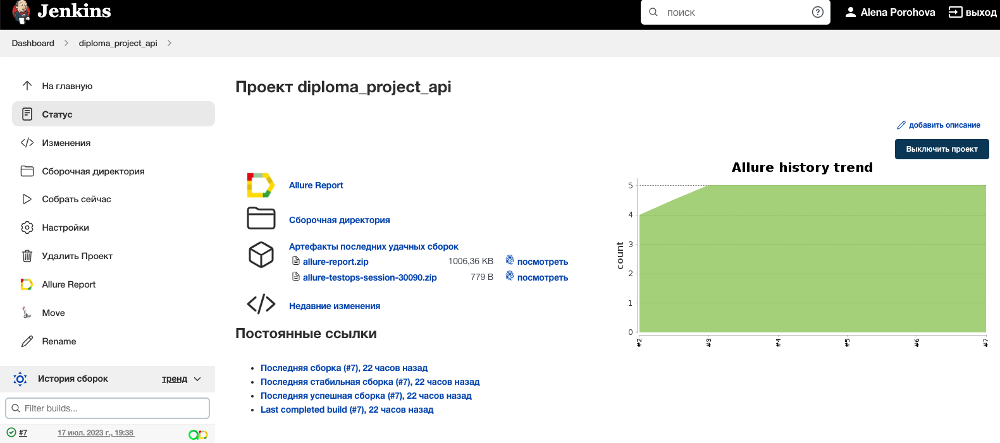</a>

***Для локального запуска:***
```bash  
✓  Создать файл app.properties и разместить по адресу src/test/resources/config/app.properties
✓  Файл должен содержать следующие данные: 
-username=username для allure.autotests.cloud
-password=пароль юзера
-baseUrl=https://allure.autotests.cloud
```
___
__
## </a> <a name="Allure"></a>Allure [отчет](https://jenkins.autotests.cloud/job/diploma_project_api/7/allure/)</a>

___

### *Основная страница отчёта*

<p align="center">  
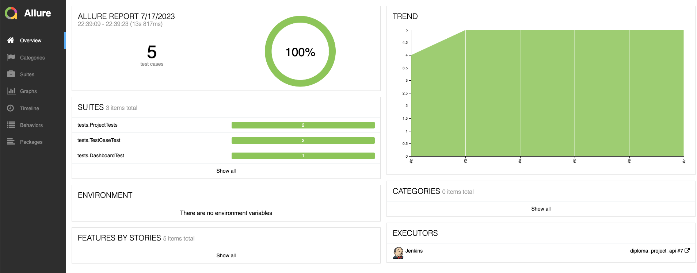  
</p>  

### *Тест-кейсы*

<p align="center">  
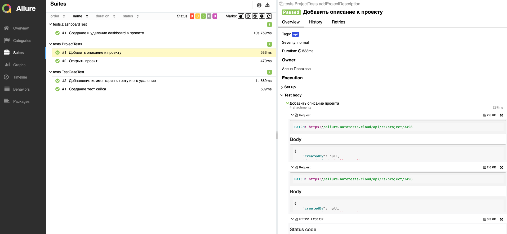  
</p>

### *Графики*


  <p align="center">  
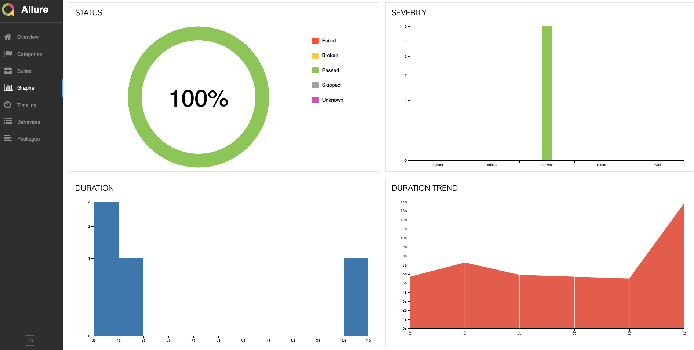  
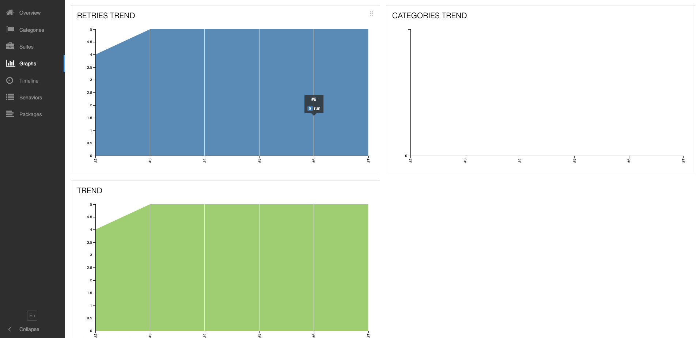  
</p>

___

## </a>Интеграция с <a target="_blank" href="https://allure.autotests.cloud/project/3512/dashboards">Allure TestOps</a>
___

### *Allure TestOps Dashboard*

<p align="center">
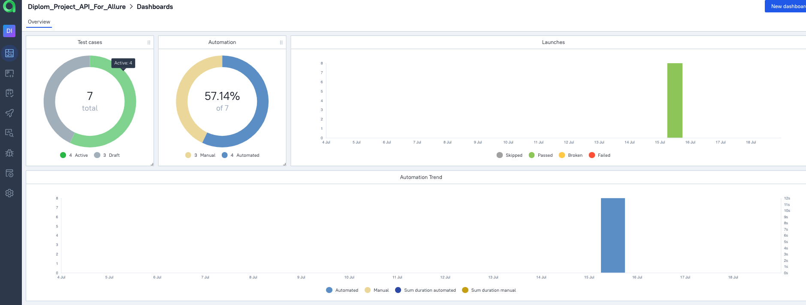  
</p> 

### *Ручные тест-кейсы*

<p align="center">  
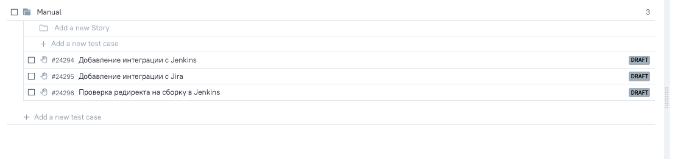  
</p>

### *Авто тест-кейсы*

<p align="center">  
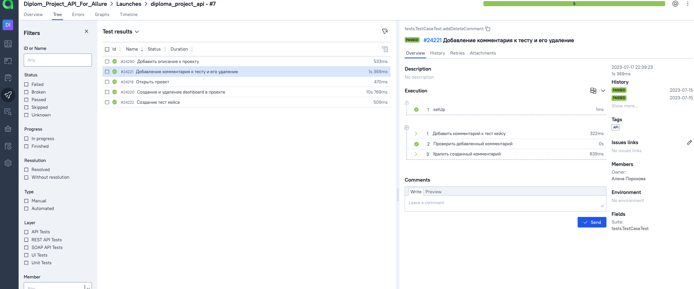  
</p>

___

## </a> Интеграция с <a target="_blank" href="https://jira.autotests.cloud/browse/HOMEWORK-791">Jira</a>
____
<p align="center">  
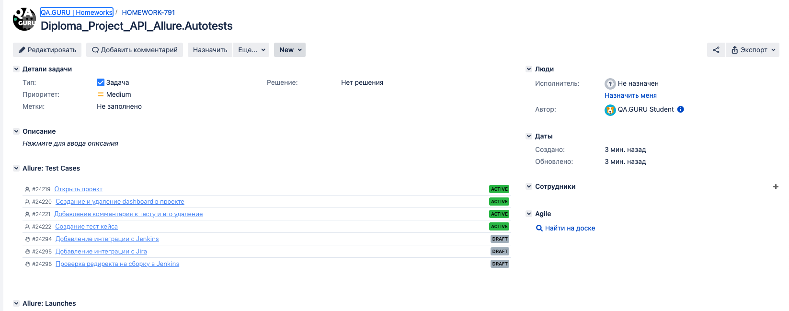  
</p>

____

## </a> Уведомление в Telegram при помощи бота
____
<p align="center">  
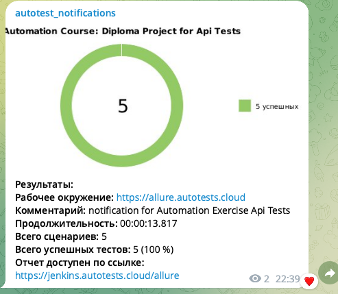  
</p>

____